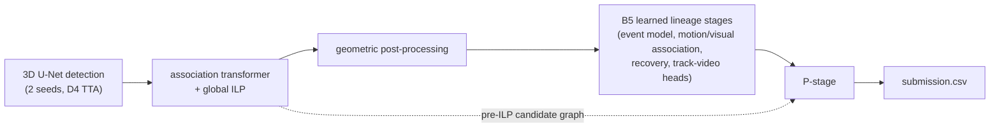

# Biohub Cell Tracking: from #2 public to #36 private, and what the private leaderboard taught me

> **Solution, code and post-mortem of my entry to Kaggle's
> [Biohub – Cell Tracking During Development](https://www.kaggle.com/competitions/biohub-cell-tracking-during-development)
> (2026, about 4,000 teams, team "Gabriel").**

[Full solution](docs/SOLUTION.md) · [Pipeline reference](docs/PIPELINE.md) · [Validation](docs/VALIDATION.md) ·
[Public vs private post-mortem](docs/PUBLIC_VS_PRIVATE.md) · [What failed](docs/EXPERIMENT_LOG.md) ·
[Reproduce](docs/REPRODUCIBILITY.md)

The task was to detect every cell nucleus in 3D + time light-sheet movies of zebrafish embryos, link each cell through time
and recover its divisions. The output is a lineage graph per movie. It is scored by an edge Jaccard with a node-count
penalty plus a division Jaccard, against a *sparse* ground truth of a few annotated lineages per movie. The hidden test set
comes from embryos that never appear in training.

My submissions are named by pipeline generation: **B1–B6** are learned lineage models, and **P1–P23** add a correction stage
on top of B5.

| | Public LB | Private LB |
|---|---:|---:|
| Frozen lineage base (my B5) | 0.965 | 0.928 |
| **Final selection** (P21 + P20) | **0.976**, #2 at the deadline | **0.937**, rank **#36** of about 4,000 |
| Best private submission (P3 / P5 / P7, not selected) | 0.972 | **0.939** |

## What I built

1. **A learned lineage base (B1–B6)** on top of a strong public baseline: 3D U-Net detection, an association transformer and
   a global ILP. I added:
   - an image-conditioned **event model**, whose network is called *b1*, with division ("fork") and edge heads;
   - learned division review, motion and visual association, and verified missed-cell recovery;
   - a track-video transformer with set-attention and LambdaRank heads.

   The baseline reports 0.947 public; my lineage base reached 0.965.
2. **A post-lineage correction stage (the "P-stage", P1–P23).** It keeps the base frozen and repairs its output graph, using
   two signals the base computes but discards: the **pre-ILP candidate graph** and the **b1 fork head**. It took public from
   0.965 to 0.976. On private, my two selected versions were worth +0.008 / +0.009 (P20 / P21) over the base, and the
   best versions +0.011 (P3 / P5 / P7).



The final P-stage (P21) runs the steps below in order. The italic item, DSR, was used only in P3, P5 and P7. Each step is
structurally checked and falls back per step or per movie.

- **Division completion.** A single-child parent gains a b1-scored second daughter. The daughter is either a track that
  currently *starts* at the next frame ("start-type", accepted at ≥ 0.85) or the only child of another parent
  ("stolen-type", accepted at ≥ 0.97).
- ***Dropped-sister recovery (DSR).*** The same, with the daughter taken from ILP-dropped detections. It was +0.004 on
  private, and **I removed it after P7** because the public leaderboard disagreed.
- **Double-fork resolution.** A cell cannot divide twice within 35 frames.
- **Learned relinking and free-end linking.** LightGBM on candidate-graph features, exported to a NumPy-only predictor.
- **Isolated-node pruning.** Drop single-node components after linking.
- **term_trim and long_link.** Remove duplicate track ends, and add candidate edges longer than the linker's radius.
- **tbext and relinefit.** Restore ILP-supported track heads and tails that the baseline's filters cut off, and redo the
  baseline's smoothing on the final structure.
- **Deletion clean-up.** Remove duplicate gap bridges, orphan fork fragments and duplicate heads, re-run term_trim, then
  remove parallel duplicates and field-of-view border stubs.

## The lesson: public #2 → private #36

**The final pick was the smallest of my problems.**

- **A detector I could not validate.** The public notebook I built on already dropped from 0.947 public to 0.916 private.
  Its detector was trained on all 199 labelled movies, so I could not validate detection locally; I froze it and repaired
  its output instead. The prize-place write-ups I read (2nd–5th) all describe their own detectors, with fold copies they
  could validate. Still, the 12th-place team reached 0.946, inside the gold zone, with the same detector weights (tuned,
  not retrained), so the detector limited my result but did not decide it on its own.
- **A public leaderboard from a different embryo.** The public and private parts of the test set came from two different
  embryos, a dense one and a much sparser one (inferred by the 3rd-place team). My late public-guided choices were in
  effect tuned on the dense one.
- **A bigger drop than the leaders.** The top two teams matched or beat their public score (the winner: 0.976 → 0.977),
  and 3rd–7th place dropped by 0.007–0.019, against 0.039 for me.
- **The selection.** Even my best private submission (0.939) sits below the gold zone (about 0.941) and well below the
  prize places (0.952 for 7th). A better selection would have gained about a dozen places, not a better medal: both ranks
  are silver.

Within those limits, my own submissions still say a lot. Kaggle scores every code submission on the full hidden set. I
recorded both scores for 28 submissions, and many pairs differ by exactly one component, which turns the leaderboard into a
controlled experiment. What those pairs show:

- **Division recall carried most of the private gain.** Start-type division completion was visible on both leaderboards
  (+0.005 public, +0.007 private). Dropped-sister recovery was −0.002 / −0.003 public but **+0.004** private, measured on two
  nested pairs that share the same forks. Lower division thresholds did not hurt on private.
- **Edge repairs transferred poorly.** Repairs that were worth +0.003–0.004 locally, even under leave-one-embryo-out, were at
  most +0.001 on private.
- **Local validation predicted private better than public did.** Across the P-series, public and private rank correlation
  is **0.29**. On the nine early models, my local held-out score correlates 0.88 with private, against 0.63 for public. The
  link weakens for later models.
- **My hedge protected against the wrong risk.** I took the best public model (P21) plus its division-neutral parent (P20)
  as a hedge. They were near-duplicates, so the hedge added little. P7, with 0.939 private, was never selected.

The details, the comparison with the rest of the field and what I would do differently are in
[docs/PUBLIC_VS_PRIVATE.md](docs/PUBLIC_VS_PRIVATE.md).

## Repository layout

```text
docs/             full write-up: solution, pipeline spec, validation, post-mortem, failure log, reproduction
pstage/           the P-stage as deployed (the Kaggle dataset biohub-p12-division-stage minus the DivNet weights):
                  stage scripts p_stage*.py, modules, every config, the LightGBM linkers as JSON
notebooks/        submitted notebooks: P21 and P20 (final selection), P7 (best private), plus build_variant.py
lineage_models/   source of the B1–B6 lineage models (training, inference, frozen protocols; no weights)
research/         ~650 research and evaluation scripts, as run (oracle bounds, LOEO, rule families, DivNet, ...)
results/          submissions.csv (public + private for every submission I recorded), validation splits
```

## Running it

**Model weights.** The weights live in two public Kaggle datasets, not in this repository:

- my frozen B5 artefact bundle, including the b1 weights `b1_best.pt`:
  [`shawsebastian/biohub-b5-b6-track-video-models-20260923`](https://www.kaggle.com/datasets/shawsebastian/biohub-b5-b6-track-video-models-20260923) (Apache-2.0);
- the P-stage dataset, identical to `pstage/` plus the DivNet weights:
  [`shawsebastian/biohub-p12-division-stage`](https://www.kaggle.com/datasets/shawsebastian/biohub-p12-division-stage) (CC0).

See [REPRODUCIBILITY.md](docs/REPRODUCIBILITY.md).

With the bundle, you can run the P-stage on the intermediate graphs that the notebook writes to `/kaggle/working/`. Keep
`lineage_graphs/`, `reference_graphs/` and `fullgraphs/` side by side: the script reads `<graphs>/../reference_graphs/`.

```bash
export OMP_NUM_THREADS=1 OPENBLAS_NUM_THREADS=1 MKL_NUM_THREADS=1 POLARS_MAX_THREADS=1 RAYON_NUM_THREADS=1
python pstage/p_stage12.py --artifact <B5 bundle> --config pstage/p21s85_config.json \
  --data <dir with the same movies' *.zarr> --graphs <working>/lineage_graphs --full <working>/fullgraphs \
  --out out/graphs --work out/work --submission out/submission.csv
```

`notebooks/build_variant.py` builds a new Kaggle variant from a verified notebook. It changes only the config, the variant
label and the description, and refuses configs that the notebook's stage script does not support. The arguments are the
source notebook, config, variant label, kernel slug, title, description and your Kaggle user name:

```bash
python notebooks/build_variant.py notebooks/p21-final-selection p23c_config.json P23C my-p23c "My P23C" "P21 with start threshold 0.80" <your-kaggle-user>
```

Scoring uses the organisers' metric (`tracking_cellmot`, pinned to commit `075fc5f`); see
[VALIDATION.md](docs/VALIDATION.md).

**Not included here:** competition data (CC0; download it from Kaggle), model weights (in the public Kaggle datasets above
and pilkwang's public datasets), and scripts that provisioned cloud machines or used credentials.

## License and credits

My code is released under the [MIT License](LICENSE). The base pipeline code in cell 2 of the notebooks and in
`lineage_models/b56/cloud_baseline.py` derives from a public Kaggle notebook and is **Apache-2.0**
([license text](LICENSES/Apache-2.0.txt)). See [THIRD_PARTY_NOTICES.md](THIRD_PARTY_NOTICES.md) for the attribution chain.

Thanks to:

- **pilkwang**, for the public detector, DeepCenter and support-pack datasets;
- **zhincez** and the authors before them (Reyhan Ksatria, and the upstream credits: nusrati, evgendvorkin), for the public
  baseline notebook;
- the **Royer lab / Biohub**, for the data, the metric and the Ultrack work behind the ground truth.
