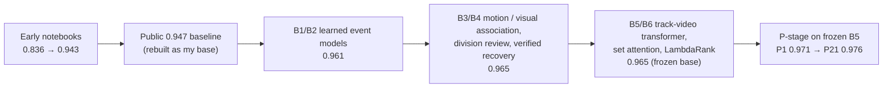
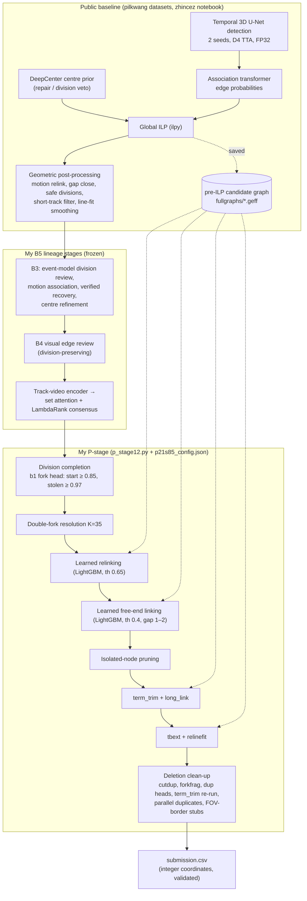

# Solution write-up: Biohub – Cell Tracking During Development

This is the full story of my entry for the Kaggle code competition
[Biohub – Cell Tracking During Development](https://www.kaggle.com/competitions/biohub-cell-tracking-during-development)
(June 29 – September 29, 2026, about 4,000 teams). I competed as team **Gabriel**.

| | Public LB (≈29 % of hidden test) | Private LB (≈71 %) |
|---|---:|---:|
| Final selection (P21 + P20) | **0.976** (#2 at the deadline) | **0.937** (rank **36** of about 4,000) |
| Best public score among my submissions (P21 / P22B / P23D) | 0.976 | 0.937 |
| Best private score among my submissions (P3 / P5 / P7) | 0.972 | **0.939** (not selected) |
| Frozen lineage base (B5) | 0.965 | 0.928 |

The short version: I rebuilt a public 0.947 baseline into a learned lineage pipeline (B1–B6, public 0.965). I then added a
**post-lineage correction stage** (the "P-stage", P1–P23) that repairs divisions and links on top of the frozen B5 output.
It took the public score from 0.965 to 0.976. On the private leaderboard, my two selected versions were worth +0.008 / +0.009
(P20 / P21) over B5, and the best versions +0.011 (P3 / P5 / P7).

Even so, I dropped 34 places in the shake-up. There were three causes; the first two overlap and I cannot size them
separately, but the last one is the smallest:

- **The foundation.** The public detector I built on was trained on all 199 labelled movies, so I could never validate
  detection, and I froze it. The public notebook itself went from 0.947 public to 0.916 private. The prize-place write-ups
  I read (2nd–5th) all describe their own detectors, with fold copies they could validate.
- **A public leaderboard from a different embryo.** Probing by the 3rd-place team indicates that the public part is one
  dense embryo and the private part a much sparser one. My late public-guided choices were in effect tuned on the dense one.
- **The final selection.** The largest private gain I gave up, *dropped-sister recovery* (DSR, +0.004 private on its two
  measured pairs), was a component I had **removed because the public leaderboard said it hurt**, even though my own local
  validation said it helped. Choosing P21 + P20 instead of a pair with P7 cost about 0.002 private (0.939 vs 0.937), about
  a dozen places.

Even my best submission (0.939) was below the gold zone (about 0.941). The 12th-place team reached 0.946 with the same
public detector weights, tuned but not retrained, and the 18th-place team 0.941 with the public detection left as it was.
Better work on top of the same detector could have reached gold without training a new one.

[`PUBLIC_VS_PRIVATE.md`](PUBLIC_VS_PRIVATE.md) contains the full post-mortem.

---

## 1. The task

Each movie is a 3D + time light-sheet recording of a developing zebrafish embryo. It is stored as an OME-Zarr array
`(T, Z, Y, X)` with voxel size `(1.625, 0.40625, 0.40625)` µm, and the densest movies hold up to about 700 nuclei per frame.

The submission is a graph per movie:

- **nodes** are cell centres `(t, z, y, x)` in integer voxel coordinates;
- **edges** link a cell at `t` to the same cell at `t+1`;
- a **division** is a node with two children.

The metric comes from the official `tracking_cellmot` code, which I pinned to commit `075fc5f`:

```text
nodes are matched one-to-one per frame within 7 µm
edge_jaccard   = TP / (TP + FP + FN)                          (sparse-GT semantics)
adjusted_edge  = max(0, edge_jaccard * (1 - 0.1 * (N_pred - N_total) / N_total))
score          = weighted mean of adjusted_edge (weights = per-movie TP+FP+FN)
               + 0.1 * micro-averaged division Jaccard
```

`N_pred` is the number of predicted nodes in the movie. `N_total` is the organisers' estimate of the total number of nuclei in
the movie, supplied with the ground truth; it is not the number of annotated nodes.

Three properties of this setup drove almost every decision I made:

1. **The ground truth is sparse.** Only a few hand-curated lineages per movie are annotated, a few percent of all cells. An
   unmatched prediction is usually *not* an error; it simply is not evaluated. The node-count term still charges every extra
   predicted node, so predicting more is not free.
2. **Divisions are rare but heavily weighted.** The 199 training movies hold 151 annotated divisions in total. On the public
   leaderboard, one correct division is worth about **+0.0016** and one false division about **−0.0007**, more than most
   edge-level improvements.
3. **The hidden test set is embryo-disjoint.** The data page states that train and test share no embryo, and that the hidden
   set is roughly the size of the training set: about 199 movies, so about 58 public and 141 private. (After the deadline,
   probing by the 3rd-place team put it at about 60 public and 106 private movies, each part from a single embryo.) All my labelled data
   came from just **two embryos**, `44b6` (71 movies) and `6bba` (128 movies). Every local number I computed is therefore a
   *same-embryo* estimate of a *new-embryo* score.

## 2. How the solution evolved



### 2.1 Early attempts (public 0.836 → 0.943)

My first five notebooks tried aggressive segmentation, test-time augmentation, and threshold, linking and repair variants.
They scored 0.836 to 0.927.

The next notebook versions, v13 and v14, added dual-seed detection, trained motion and division classifiers, and full-movie
post-processing comparisons. They reached 0.938 and 0.943 public, although v14 had scored 0.974 locally: my first lesson in
how optimistic local numbers can be. v24 added geometric and multi-frame brightness classifiers. Its CPU run timed out, and
the repaired 2×T4 version scored 0.940 public (0.914 private).

### 2.2 B-series: learned lineage models on a strong public base (0.961 → 0.965)

I then rebuilt everything on the public notebook
[*Biohub 0.947 LB, runnable with public datasets*](https://www.kaggle.com/code/zhincez/biohub-0-947-lb-runnable-with-public-datasets).
It uses three public datasets by **pilkwang**: a temporal 3D U-Net detector with its support pack, a second detector seed,
and a DeepCenter U-Net3D centre prior. The attribution chain is in
[`THIRD_PARTY_NOTICES.md`](../THIRD_PARTY_NOTICES.md).

The base has five parts:

- dual-seed temporal 3D U-Net detection with 8-view D4 test-time augmentation in FP32;
- a DeepCenter veto for gap repairs and safe divisions;
- a node-association transformer that gives edge probabilities;
- a global ILP (`ilpy`) with appearance, disappearance and division weights;
- geometric post-processing: motion relinking, single-frame gap closing, gap-2 recovery, "safe" division addition, a filter
  that drops tracks shorter than 6 nodes, and ±2-frame line-fit smoothing.

On top of it I trained a sequence of learned lineage stages. Each was calibrated on 18 movies and audited on 18 more, and the
4 visible preview movies were always excluded. The central piece is an **event model**. Its networks are called *b1* (from
B1) and *b2* (from B2), stored as `b1_best.pt` and `b2_pretrained_best.pt`. Lower-case b1 / b2 always means these networks;
upper-case B1–B6 means pipeline versions.

| Model | What it added | Public / private |
|---|---|---|
| B1 | 3-frame residual 3D event model *b1* with a division ("fork") head and an edge head, trained on 159 movies with hard negatives mined from the real detector | 0.961 / 0.924 |
| B2 | 5-frame event model *b2* with pretrained U-Net features | 0.961 / 0.924 |
| B3 | learned **division review**, rotation-invariant **motion association**, 7-frame **missed-cell recovery** verified by an independent model, 7-frame **centre-offset refinement** | 0.965 / 0.928 |
| B4 | B3 with the motion association replaced by an **image-embedding + motion** visual association | 0.965 / 0.928 |
| B5 | full B3, then a division-preserving B4 visual edge review, then a new **track-video encoder** (local 3-frame 3D crops + 10-step trajectory transformer, trained with corrupted-track augmentation) feeding two **candidate-set attention** heads and a **3-seed LambdaRank** consensus | 0.965 / 0.928 |
| B6 | B5 with only the LambdaRank head | 0.965 / 0.928 |

Calibration went from 0.961 (B2) to 0.983 (B5) and the 18-movie audit from 0.941 to 0.954, but the public score stopped moving
at 0.965. B5 was far more complex than B3 and gave no visible public gain. I still froze B5, which had the best calibration
and audit scores (the decision is recorded in `lineage_models/b56/submission_decision_b56.json`), as the base for everything
that followed. Its artefact bundle also contains b1, whose **fork head** became the workhorse of the P-stage.

### 2.3 P-series: a correction stage on top of the frozen base (0.965 → 0.976)

At the time I concluded that retraining image models could not be validated fairly: the public detector had been trained on
all 199 movies, and every movie comes from one of only two embryos. (In hindsight, the answer was to retrain the detector
itself per fold, so that it *could* be validated; see §7.) So I switched strategy: **keep B5 frozen and repair its output
graph** with signals that B5 computes but throws away.

The first signal is the saved **pre-ILP candidate graph** (`fullgraphs/*.geff`). It holds every detection and candidate
edge with its probability, including the many that the ILP dropped. The second is the **b1 fork head**, which scores any
(parent, daughter, daughter) triple.

The stage runs per movie and checks the graph structure after each step. Most steps fall back to the previous graph on an
error; any other failure keeps the movie's B5 graph.

The stage grew over 23 versions. The table orders them so that each row adds one step to an earlier row, not by version
number: P2 is the start-only ablation of P1, and P4 is P3 without DSR. P8, P9, P10, P12, P19, P23A and P23B were built but
not submitted; they are described in [`PIPELINE.md`](PIPELINE.md).

| Version | Built on | Added | Public | Private |
|---|---|---|---:|---:|
| P2 | B5 | **division completion**, start-type only: a parent with one child gains a second daughter that currently *starts* a new track, if b1 fork ≥ 0.90 | 0.970 | 0.935 |
| P1 | P2 | + **stolen-type** completion: the daughter is taken from another single-child parent if b1 fork ≥ 0.97 | 0.971 | 0.934 |
| P4 | P1 | + **double-fork resolution** (a cell cannot divide twice within K frames) | 0.974 | 0.935 |
| P3 | P4 | + **dropped-sister recovery (DSR)**: the second daughter is a *dropped* pre-ILP detection, b1 ≥ 0.98 | 0.972 | **0.939** |
| P6 | P4 | + **learned relinking** and **learned free-end linking** (LightGBM on candidate-graph features) | 0.975 | 0.935 |
| P5 | P3 | + the same learned linking | 0.972 | **0.939** |
| P7 | P5 | pruning moved after linking | 0.972 | **0.939** |
| P11 / P13 | P6 | pruning after linking + **whole-movie double-fork resolution** (K=100, then K=35) | 0.975 | 0.935 |
| P14 | P13 | + **term_trim** (duplicate track ends) + **long_link** (candidate edges > 14 µm) | 0.975 | 0.935 |
| P15 | P14 | + **tbext** (track head/tail extension: restore ILP-supported heads and tails cut by the baseline's filters) + **relinefit** (redo the baseline's smoothing on the final structure) | 0.975 | 0.936 |
| P17 | P15 | + deletion clean-up: cutdup, forkfrag, shortbranch | 0.974 | 0.937 |
| P20 | P15 | + robust deletion-only clean-up (no shortbranch) | 0.975 | 0.936 |
| **P21** | P20 | start-type threshold 0.90 → **0.85** | **0.976** | 0.937 |
| P22A / P22B | P20 / P21 | + global-jump compensated relinking | 0.975 / 0.976 | 0.936 / 0.937 |
| P23C / P23D | P21 | start-type threshold 0.80 / 0.825 | 0.975 / 0.976 | **0.938** / 0.937 |

P16a, P16b and P18 (built on P15 / P17) replaced b1's division ranking with a new model, **DivNet**, an event-centred 3D CNN.
They were worse everywhere: public 0.967–0.973, private 0.932–0.933.

Every step is specified with exact parameters, mechanisms and evidence in [`PIPELINE.md`](PIPELINE.md).

## 3. The final pipeline



On Kaggle (2×T4, internet off) the notebook takes about 27–30 minutes for the 4 preview movies and about 9 hours for the
full hidden set, against a 12-hour limit. The P-stage itself takes 2–3 minutes on the 4 preview movies.

The notebook has three layers of protection:

1. If more than 10 hours have passed before the P-stage starts, it is skipped.
2. Once 11 hours have passed, the P-stage stops editing and leaves the remaining movies as B5 produced them.
3. On any failure the validated B5 submission is restored.

## 4. How I validated

The local protocol is in [`VALIDATION.md`](VALIDATION.md). In brief:

- **Official metric wherever possible.** I scored the exact integer-coordinate CSV per movie with the pinned official code,
  then aggregated exactly as the leaderboard does. A few early ideas were dropped on classifier AUC alone; the failure log
  marks them.
- **Five fixed movie groups:**
  - `hold36`: the 18 calibration + 18 audit movies of b1 and B5, never used to train any P-stage model;
  - `prev4`: the 4 visible test preview movies;
  - `audit32`: held out from B5;
  - `t127a` and `t127b`: B5 training movies.

  `clean40` = hold36 + prev4 is the cleanest held-out set.
- **Paired movie-bootstrap confidence intervals,** with per-embryo deltas reported alongside.
- **A fixed strict gate (S1–S7) from P16 onwards,** extended from P19 to an 8-point multi-check. The eight points are:
  1. independent re-implementation, plus replay on the CSV and on Kaggle;
  2. matched placebos;
  3. every one-step parameter neighbour must pass;
  4. ablation and leave-one-rule-out;
  5. the same rule on other base graphs;
  6. exact drop-top-k;
  7. a node / edge / division split with event counts;
  8. thresholds chosen on one subset and evaluated on another.

  Risky bets were also pre-registered.
- **Leave-one-embryo-out (LOEO)** re-training for every learned component, to estimate transfer to a new embryo.
- **Kaggle-side verification.** Before submission, every notebook was run on the 4 preview movies and its output compared
  with the local pipeline, movie by movie.

## 5. What happened on the private leaderboard

The final leaderboard dropped me from **#2 public to #36 private**. My own submissions tell a fairly consistent story.

- **Division recall carried most of the private gain.**
  - Start-type division completion was clearly positive on both leaderboards: +0.005 public, +0.007 private.
  - DSR got the wrong sign on public: −0.002 / −0.003 public, but **+0.004** private. This was measured on two nested pairs
    (P4 → P3 and P6 → P5) that add the same DSR forks, with and without the learned linking.
  - Lowering the start threshold did not hurt on private: +0.001 for 0.90 → 0.85, then 0.000 for 0.85 → 0.825 and +0.001
    for 0.85 → 0.80, all at the 3-decimal resolution limit. On public, 0.85 → 0.80 was −0.001.
- **Edge-level repairs that looked big locally were small on private.**
  - Learned linking was +0.003 locally and about 90 % retained under LOEO, but private showed no visible change
    (P4 = P6 = 0.935).
  - The P6 → P20 rules together were about +0.004 on clean40 and at most +0.001 on private.
- **Replacing b1's division choices hurt everywhere.** DivNet lost 0.005–0.008 in cross-embryo tests and 0.004 on private.
- **Rank correlations.**
  - On the nine early models (B3, B5, P1–P7), local clean40 correlates **0.88** with private, against 0.63 for public.
  - Adding four later models, it is 0.68 against 0.35.
  - Across all 21 P-series submissions, public vs private is only **0.29**.
  - The local relationship breaks down for the late models: P15 and P21 rank above P7 locally and below it on private.

**My own local validation predicted the private ranking better than the public leaderboard did, though not perfectly.** The
costliest decision I let the public leaderboard make was removing DSR after P3, P5 and P7. For the final pick I took the best
public submission (P21) plus its division-neutral parent (P20) as a hedge. P7, at 0.939 private, was sitting unselected in my
list.

**The rest of the field puts that in proportion.**

- P7 would have tied for about 22nd–26th, still below the gold zone (about 0.941, rank 18) and far from the prize places
  (0.952 for 7th).
- The public notebook I built on scored 0.947 public and 0.916 private.
- The public and private parts appear to be two different embryos, a dense one and a much sparser one (from the 3rd-place
  team's probing). Most teams near me dropped by 0.02–0.04; my 0.039 was the largest drop in the private top 49.
- The prize-place write-ups I read (2nd–5th) describe their own detectors, with fold copies they could validate, plus
  cross-embryo checks (4th) or external pretraining (5th). The top two teams matched or beat their public score; the
  winner, whose write-up was not yet posted, scored 0.977 private against 0.976 public.
- Teams that kept public detection, as I did, finished at 0.941 (18th) and 0.946 (12th, inside the gold zone).

So my private drop was mostly not about my selection. It came from a foundation I could not validate and a public
leaderboard drawn from a different embryo. The 12th- and 18th-place results show that better work on the same public
detector, tuning it and repairing its output, could still have reached gold. [`PUBLIC_VS_PRIVATE.md`](PUBLIC_VS_PRIVATE.md)
§4 has the numbers and links to those write-ups.

## 6. What did not work

I tested more than a hundred ideas. None of them held up under local validation, the strict gate or the leaderboard. The
full log is in [`EXPERIMENT_LOG.md`](EXPERIMENT_LOG.md). Highlights:

- **Node deletion to game the node-count term.** Junk-track pruning with a Poisson GBM gave +0.0009 on clean40 but −0.40 when
  trained on one embryo and applied to the other. Whether a track is annotated depends on the embryo.
- **Every "second opinion" for divisions.**
  - DivNet beat a b1 retrained the same way under LOEO. As a replacement or blend for the deployed b1 it lost 0.005–0.008
    locally and 0.004 on private.
  - b1 test-time augmentation, b1 + b2 joint scoring and b1 multi-seed ensembles were all flat or negative.
  - Re-cropping b1's inputs around a virtual parent raised AUC, but reached only 3.5 % precision on genuinely new divisions.
- **Learned coordinate refinement** (3D CNN): −0.0007 to −0.011. The ceiling of +0.024 comes from annotation noise, not from
  any direction visible in the image.
- **B5-level knobs.**
  - ILP division weight 0.4 was −0.0015 at the B5 level, and positive only through one lucky division after the P-stage.
  - Detection thresholds of 0.94–0.95 gave −0.0001 to −0.0018 and 37–54 k extra nodes.
  - Frozen frames (pixel-identical consecutive frames) were already handled correctly.
- **Oracle bounds.** With the B5 detector frozen, no GT-free post-processing I could find adds +0.01. The GT-aware ceilings of
  the remaining families are:
  - +0.006–0.010, if you knew which of two straddling tracks is the annotated one;
  - +0.024 for coordinate refinement, mostly annotation noise.

  The remaining errors are missed detections and "stolen" divisions that b1 cannot see.

## 7. What I would do differently

1. **Put the effort upstream sooner. This is the big one.** I could not validate the public detector, so I froze it and
   worked around it. The better answer would have been to train my own detector per fold or per embryo, so that it *could*
   be validated.
   - By P13 the oracle bounds already showed that post-processing on the frozen detector could not add +0.01 (§6). That
     was the point to switch.
   - The leaderboard supports this: the 2nd- to 5th-place write-ups describe their own detectors with fold copies they
     could validate, plus cross-embryo validation, external pretraining, ensembles or test-time augmentation, and all four
     finished at 0.954 or above on private.
   - That needed days of GPU time, which I spent instead on post-processing rules worth ±0.0003.
2. **Select one model per hypothesis.** I took the best public model (P21) plus its division-neutral parent (P20) as a
   hedge. They differ by about one added fork per movie, so the hedge carried almost no independent information. Pairing the
   best *locally* validated division-aggressive model (P7) with P21 would have scored 0.939.
3. **Treat the public leaderboard as a small, noisy test set, and check what it contains.** If the new embryos resemble the
   training ones, the public part holds only about 40 annotated divisions, so a 0.002 public swing is one or two division
   events. It also appears to be a single, dense embryo, unlike the private one. A local improvement that holds on *both*
   embryos and on clean40 should not be overturned by a single public reading. At the time I reasoned that dropping a
   component because of the public leaderboard was the "conservative" direction. It was not: it removed a +0.004 private
   component.
4. **Model division recall per embryo.** The b1 fork head may have been *under-confident* on the unseen embryos: start-type
   completion transferred at full strength, and lower thresholds did not hurt on private. A calibration step per embryo, such
   as matching the fork-score distribution of each new movie, might have captured this without guessing thresholds.

## 8. Engineering notes

- **Reproducibility checks.** Given the same input graphs, the P-stage is deterministic. Reruns on different cloud machines
  matched movie by movie, apart from single-node floating-point differences in 2 movies on one machine. Kaggle outputs
  matched local outputs to within 1–4 nodes per movie (T4 vs H100 arithmetic in the upstream detector), with identical edges
  and forks on the preview movies. Every submission was checked this way.
- **Dependency-free inference for the LightGBM models.** They are exported to JSON and evaluated by a 60-line NumPy predictor
  (`pstage/lgb_np.py`) whose predictions match LightGBM's to within 2e-16, so Kaggle's library versions never mattered.
- **Thread-limit pitfalls on containers.** Multiprocessing plus the default BLAS, polars or blosc threads exhausted the
  container's `pids.max` and deadlocked. The research process pools set `OMP/OPENBLAS/MKL/POLARS/RAYON_NUM_THREADS=1` and
  `numcodecs.blosc.use_threads = False`. The P-stage runs one worker per GPU, on at most two GPUs, with 2 BLAS threads each.
- **Compute.**
  - B1–B4 were trained on H200 cloud GPUs, and B5/B6 on 4× H100.
  - The P-series work ran on RTX PRO 6000, A100 and H100 machines.
  - A full 199-movie P-stage rerun takes about 10–15 minutes on a 4-GPU machine, with the five movie groups run as parallel
    processes.
  - Rerunning the Kaggle notebook's base pipeline off-Kaggle takes about 80 minutes per 100 movies on 2× H100.
- **Reading unrounded public scores.** The leaderboard shows only 3 decimals. When exactly one submission is selected
  manually, Kaggle's auto-selection marker points at the best *unrounded* public score among the rest. That is how I ordered
  submissions that all showed 0.976.

## 9. Acknowledgements

- **pilkwang**, for the public detector, DeepCenter and support-pack datasets.
- **zhincez**, and the authors of the notebooks it was built on (Reyhan Ksatria; upstream credits also name nusrati and
  evgendvorkin), for the public 0.947 notebook that my B-series was built on.
- The **Royer lab / Biohub** team, for the data, the metric code and the Ultrack work that explains how the ground truth was
  produced.
